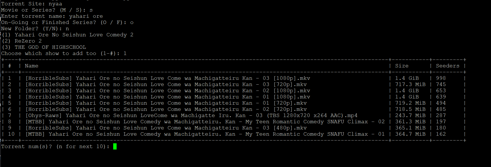

# magnetfinder
grabs magnet links for selected torrents through CLI (https://www.magnetfinder.net for web version)

Supported Websites:
- nyaa 
- piratebay



## Installation
Install the external dependencies<br/>
```
pip install -r requirements.txt
```
and now run the script using python3
```
python3 magnetfinder.py
```

## Usage
After selecting whether nyaa or piratebay, specify if its a movie or series and give a search query<br/>
In the terminal a PrettyTable will be returned with the top 20 torrent links sorted by seeders from that website<br/>
Select which torrent by number, and it will either start the download or return the magnet link based on configuration<br/>

If its a series, you will be asked if its a ongoing series, to determine whether the directory should be an existing folder or a new one<br/>

## Configure
Edit the config.ini to change the default directories, and autodownload status<br/>
Enabling automatic torrent downloads allows deluge-console on linux, or aria2c on windows to run with the script<br/>

Current default directory is your Downloads folder, and the default status for automatic torrent downloads is false

## Aria2c on Windows
To install aria2c on windows:<br/> 
go to https://aria2.github.io/ and download the latest version, unzip and then add the folder directory to your windows PATH
